## 从mongodb中取出分析数据


```python
# con
import pymongo
import numpy as np
import pandas as pd
import matplotlib.pyplot as plt

# 连接mongodb数据库
client = pymongo.MongoClient('localhost',port=27017)
db = client.test
collenction = db.lagoudata2

# 从mongodb数据库获取数据
data = collenction.find()
data = pd.DataFrame(list(data))

```

## 数据清洗
* 对获取的数据剔除无意义数据
* 计算每个职位的平均工资
* 去重


```python

# 剔除无意义数据并进行去重
columns = [ 'menu_name', 'job_place', 'jobClass', 'job_id', 'jobName', 'job_payment','job_scr',\
            'positionlabel','job_experience','job_ed', 'compansnum', 'jobCompany', 'jobPlace']
data = data[columns].drop_duplicates(subset='job_id',keep='first')


# 处理平均薪酬
def cut_word(word,method='bottom'):
    """定义获取每个职位的最高薪酬和最低薪酬"""
    position = word.find('-')
    length = len(word)
    if position != -1:
        bottomsalary = word[:position-1]
        topsalary = word[position+1:length-1]
    else:
        bottomsalary = word[:word.upper().find('K')]
        topsalary = bottomsalary
    if method == 'bottom':
        return bottomsalary
    else:
        return topsalary
    
data['topsalary'] = data.job_payment.apply(cut_word,method = 'top')
data['bottomsalary'] = data.job_payment.apply(cut_word)
data['avgsalary'] = data.apply(lambda x: ((float(x['bottomsalary']))+(float(x['topsalary'])))/2,axis=1)

data.head()


# 只取招聘职位总数前12的城市
head12 = list(data.job_place.value_counts().head(12).index) 
data = data[data['job_place'].isin(head12)]
data.job_place.value_counts()


# 清洗后的数据
df_clean = data[[ 'menu_name', 'job_place', 'jobClass', 'job_id', 'jobName', 'job_payment',\
            'positionlabel','job_experience','job_ed', 'compansnum', 'jobCompany', 'jobPlace','avgsalary']]

data.head()


```


<div>
<style scoped>
    .dataframe tbody tr th:only-of-type {
        vertical-align: middle;
    }

    .dataframe tbody tr th {
        vertical-align: top;
    }

    .dataframe thead th {
        text-align: right;
    }
</style>
<table border="1" class="dataframe">
  <thead>
    <tr style="text-align: right;">
      <th></th>
      <th>menu_name</th>
      <th>job_place</th>
      <th>jobClass</th>
      <th>job_id</th>
      <th>jobName</th>
      <th>job_payment</th>
      <th>job_scr</th>
      <th>positionlabel</th>
      <th>job_experience</th>
      <th>job_ed</th>
      <th>compansnum</th>
      <th>jobCompany</th>
      <th>jobPlace</th>
      <th>topsalary</th>
      <th>bottomsalary</th>
      <th>avgsalary</th>
    </tr>
  </thead>
  <tbody>
    <tr>
      <th>0</th>
      <td>技术</td>
      <td>上海</td>
      <td>白盒测试</td>
      <td>4514376</td>
      <td>软件测试工程师（白盒）</td>
      <td>10k-20k</td>
      <td>[QA, QA, UNIX, LINUX]</td>
      <td>[初级, 白盒, Java, 测试]</td>
      <td>不限</td>
      <td>本科</td>
      <td>150-500人</td>
      <td>泰为</td>
      <td>上海-长宁区-娄山关路523号金虹桥国际中心</td>
      <td>20</td>
      <td>10</td>
      <td>15.0</td>
    </tr>
    <tr>
      <th>1</th>
      <td>技术</td>
      <td>北京</td>
      <td>DB2</td>
      <td>4366784</td>
      <td>DB2工程师</td>
      <td>15k-20k</td>
      <td>[DB, LINUX, AIX, HP, UNIX, SHELL, PURESCALE, D...</td>
      <td>[资深, 高级, 数据库, 运维, DBA, DB2]</td>
      <td>5-10年</td>
      <td>大专</td>
      <td>150-500人</td>
      <td>云和恩墨</td>
      <td>北京-朝阳区-光华路9号光华路soho二期b座10层</td>
      <td>20</td>
      <td>15</td>
      <td>17.5</td>
    </tr>
    <tr>
      <th>2</th>
      <td>技术</td>
      <td>广州</td>
      <td>DB2</td>
      <td>3055927</td>
      <td>DB2/Informix高级DBA</td>
      <td>8k-15k</td>
      <td>[DB, INFORMIX, DB, INFORMIX, INFORMIX, DB, INF...</td>
      <td>[MySQL, 云计算, linux, DBA, DB2, Java]</td>
      <td>3-5年</td>
      <td>大专</td>
      <td>15-50人</td>
      <td>颉一软件</td>
      <td>广州-天河区-大观中路科汇园E栋406</td>
      <td>15</td>
      <td>8</td>
      <td>11.5</td>
    </tr>
    <tr>
      <th>3</th>
      <td>技术</td>
      <td>杭州</td>
      <td>电商产品经理</td>
      <td>4644136</td>
      <td>电商产品经理</td>
      <td>10k-20k</td>
      <td>[APP, UI, IOS, ANDROID, H]</td>
      <td>[客户端, 产品经理, 需求分析, 移动, 电商]</td>
      <td>1-3年</td>
      <td>本科</td>
      <td>50-150人</td>
      <td>青友汇</td>
      <td>杭州-江干区-钱江新城荣安大厦1401</td>
      <td>20</td>
      <td>10</td>
      <td>15.0</td>
    </tr>
    <tr>
      <th>4</th>
      <td>技术</td>
      <td>北京</td>
      <td>游戏动作</td>
      <td>2075674</td>
      <td>游戏动作</td>
      <td>8k-16k</td>
      <td>[]</td>
      <td>[游戏, 动作]</td>
      <td>不限</td>
      <td>不限</td>
      <td>15-50人</td>
      <td>奥矩科技</td>
      <td>北京-朝阳区-大屯路东170号凯旋城E座605</td>
      <td>16</td>
      <td>8</td>
      <td>12.0</td>
    </tr>
  </tbody>
</table>
</div>


```python
data.info()
```

    <class 'pandas.core.frame.DataFrame'>
    Int64Index: 5648 entries, 0 to 6057
    Data columns (total 16 columns):
    menu_name         5648 non-null object
    job_place         5648 non-null object
    jobClass          5648 non-null object
    job_id            5648 non-null object
    jobName           5648 non-null object
    job_payment       5648 non-null object
    job_scr           5648 non-null object
    positionlabel     5648 non-null object
    job_experience    5648 non-null object
    job_ed            5648 non-null object
    compansnum        5648 non-null object
    jobCompany        5648 non-null object
    jobPlace          5648 non-null object
    topsalary         5648 non-null object
    bottomsalary      5648 non-null object
    avgsalary         5648 non-null float64
    dtypes: float64(1), object(15)
    memory usage: 750.1+ KB
    

## 数据分析
### 城市与招聘数目
* 一般分类数据用value_counts
* 数值数据用describe,这是最常用的两个统计函数


```python
"""
先对城市和招聘公司去重，然后再进行统计

1、先对数据进行基础清洗
2、统计城市职位数量
3、统计城市招聘公司数量
4、根据城市合并结果集
5、根据合并结果画图

"""
import matplotlib.pyplot as plt
from pylab import mpl
mpl.rcParams['font.sans-serif'] = ['FangSong'] # 指定默认字体
#mpl.rcParams['axes.unicode_minus'] = False # 解决保存图像是负号'-'显示为方块的问题

# 统计城市职位数量
job_city_number = df_clean.job_place.value_counts()
job_city_number = job_city_number.rename('city_number')

# 统计城市招聘公司数量
# 去重
job_city_recruit = df_clean.drop_duplicates(['job_place','jobCompany'])[['job_place','jobCompany']]
# value_counts进行计数，返回Series对象
job_city_recruit = job_city_recruit.job_place.value_counts()
# 对Series标签进行修改
job_city_recruit = job_city_recruit.rename('city_recruit')

# 将统计数据集进行合并
frames = [job_city_number,job_city_recruit]
job_city = pd.concat(frames,axis=1)
# 排序
job_city = job_city.sort_values(by='city_number',ascending=False).head(10) 


# 使用matplotlib.pyplot 画图
# 方法一：
x = np.arange(len(job_city.index))
y = job_city
# 柱状图宽度
bar_width = 0.35 
# 设置字体样式，分别是字体，颜色，宽度，大小
font = {'family': 'FangSong',  
        'color':  'purple',  
        'weight': 'normal',  
        'size': 10,  
        }

rects1 = plt.bar(x,job_city['city_number'],bar_width,
                 tick_label=job_city.index,label=u'岗位数量')
rects2 = plt.bar(x+bar_width,job_city['city_recruit'],bar_width,
                 label=u'招聘公司数量')

# 添加图标标签
"""
xticks与yticks（设置坐标轴刻度）
xlabel与ylabel（设置坐标轴标签）
title（标题）
legend（图例）
xlim与ylim（设置坐标轴数据范围）
grid（设置网格线）

text(图形中添加文字说明,常用于添加数据标签)
"""
# 设置图标标签
plt.title(u'拉钩网招聘职位与招聘公司数量',fontdict=font)
# 设置坐标轴标签
plt.xlabel(u'城市名')
plt.ylabel(u'数量')
# 可以自己调节图例的位置 loc=1 在右上角 =2左上角 =3 左下角 =4 右下角 一般使用 =‘best’ 自动调整
#plt.legend(handles=[l1,l2],labels=[u'岗位数量',u'招聘公司数量'],loc='best')
plt.legend(loc='best')

# 设置数据标签
for rect in rects1+rects2:
    h = rect.get_height()
    plt.text(rect.get_x()+rect.get_width()/2,h,'%d' % int(h), ha='center', va='bottom')

# 调整凸显边距
plt.subplots_adjust(left=0.15)
    
# 显示网格
plt.grid(True,linestyle = '-.',linewidth = 0.5)

```


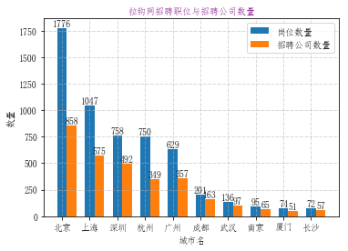


图标数据说明:


## 箱线图分析
* 观察不同城市的平均工资的情况
* 箱线图，是利用数据中的五个统计量：最小值、第一四分位数、中位数、第三四分位数与最大值来描述数据的一种方法，它可以初略地看出数据是否具有对称新，分布的分散程度等信息，特别可以用于几个样本的比较


```python
# 查看前 12个城市的岗位平均工资情况
df_clean.boxplot(column = 'avgsalary', by='job_place')
#df_clean.head()
```


    <matplotlib.axes._subplots.AxesSubplot at 0x2e428f0c550>


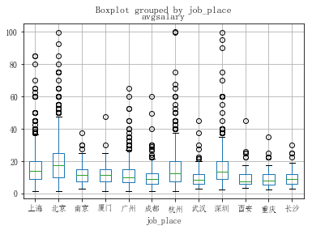


从图中可以看到，北京平均薪酬远高于其他城市


```python
# 从学历来看
df_clean.boxplot(column = 'avgsalary',by='job_ed')
```


    <matplotlib.axes._subplots.AxesSubplot at 0x2e4290f9a90>


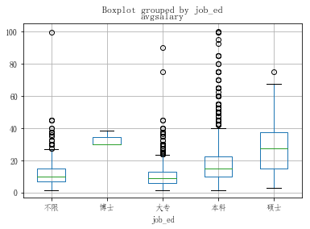


```python
# 从工作年限看
df_clean.boxplot(column='avgsalary', by='job_experience',figsize=(9,7))
```


    <matplotlib.axes._subplots.AxesSubplot at 0x2e429ccd2b0>


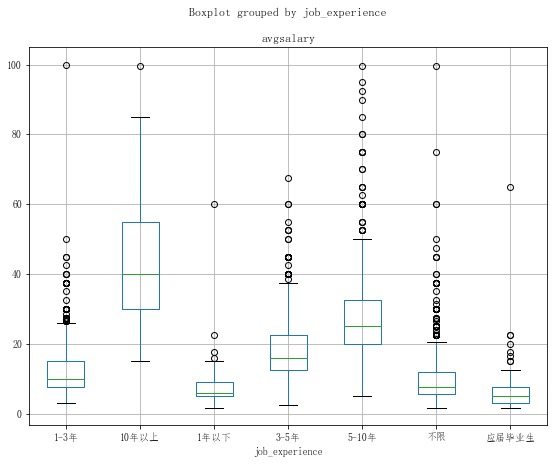


### 单独分析北京和上海学历对薪资的影响


```python
df_sh_bj = df_clean[df_clean['job_place'].isin(['上海','北京'])]

df_sh_bj.boxplot(column='avgsalary',by=['job_ed','job_place'],figsize=(9,7))
plt.xlabel(u'城市与学历')
plt.ylabel(u'工资（k）')
```


    Text(0,0.5,'工资（k）')


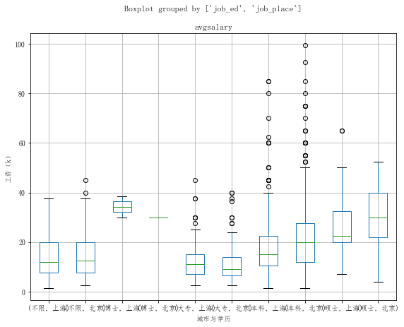


## 多维度分析
* 使用 groupby函数


```python
df_clean.groupby('job_place')
```


    <pandas.core.groupby.DataFrameGroupBy object at 0x000002E429E01080>


```python
df_clean.groupby('job_place').count()
```


<div>
<style scoped>
    .dataframe tbody tr th:only-of-type {
        vertical-align: middle;
    }

    .dataframe tbody tr th {
        vertical-align: top;
    }

    .dataframe thead th {
        text-align: right;
    }
</style>
<table border="1" class="dataframe">
  <thead>
    <tr style="text-align: right;">
      <th></th>
      <th>menu_name</th>
      <th>jobClass</th>
      <th>job_id</th>
      <th>jobName</th>
      <th>job_payment</th>
      <th>positionlabel</th>
      <th>job_experience</th>
      <th>job_ed</th>
      <th>compansnum</th>
      <th>jobCompany</th>
      <th>jobPlace</th>
      <th>avgsalary</th>
    </tr>
    <tr>
      <th>job_place</th>
      <th></th>
      <th></th>
      <th></th>
      <th></th>
      <th></th>
      <th></th>
      <th></th>
      <th></th>
      <th></th>
      <th></th>
      <th></th>
      <th></th>
    </tr>
  </thead>
  <tbody>
    <tr>
      <th>上海</th>
      <td>1047</td>
      <td>1047</td>
      <td>1047</td>
      <td>1047</td>
      <td>1047</td>
      <td>1047</td>
      <td>1047</td>
      <td>1047</td>
      <td>1047</td>
      <td>1047</td>
      <td>1047</td>
      <td>1047</td>
    </tr>
    <tr>
      <th>北京</th>
      <td>1776</td>
      <td>1776</td>
      <td>1776</td>
      <td>1776</td>
      <td>1776</td>
      <td>1776</td>
      <td>1776</td>
      <td>1776</td>
      <td>1776</td>
      <td>1776</td>
      <td>1776</td>
      <td>1776</td>
    </tr>
    <tr>
      <th>南京</th>
      <td>95</td>
      <td>95</td>
      <td>95</td>
      <td>95</td>
      <td>95</td>
      <td>95</td>
      <td>95</td>
      <td>95</td>
      <td>95</td>
      <td>95</td>
      <td>95</td>
      <td>95</td>
    </tr>
    <tr>
      <th>厦门</th>
      <td>74</td>
      <td>74</td>
      <td>74</td>
      <td>74</td>
      <td>74</td>
      <td>74</td>
      <td>74</td>
      <td>74</td>
      <td>74</td>
      <td>74</td>
      <td>74</td>
      <td>74</td>
    </tr>
    <tr>
      <th>广州</th>
      <td>629</td>
      <td>629</td>
      <td>629</td>
      <td>629</td>
      <td>629</td>
      <td>629</td>
      <td>629</td>
      <td>629</td>
      <td>629</td>
      <td>629</td>
      <td>629</td>
      <td>629</td>
    </tr>
    <tr>
      <th>成都</th>
      <td>201</td>
      <td>201</td>
      <td>201</td>
      <td>201</td>
      <td>201</td>
      <td>201</td>
      <td>201</td>
      <td>201</td>
      <td>201</td>
      <td>201</td>
      <td>201</td>
      <td>201</td>
    </tr>
    <tr>
      <th>杭州</th>
      <td>750</td>
      <td>750</td>
      <td>750</td>
      <td>750</td>
      <td>750</td>
      <td>750</td>
      <td>750</td>
      <td>750</td>
      <td>750</td>
      <td>750</td>
      <td>750</td>
      <td>750</td>
    </tr>
    <tr>
      <th>武汉</th>
      <td>136</td>
      <td>136</td>
      <td>136</td>
      <td>136</td>
      <td>136</td>
      <td>136</td>
      <td>136</td>
      <td>136</td>
      <td>136</td>
      <td>136</td>
      <td>136</td>
      <td>136</td>
    </tr>
    <tr>
      <th>深圳</th>
      <td>758</td>
      <td>758</td>
      <td>758</td>
      <td>758</td>
      <td>758</td>
      <td>758</td>
      <td>758</td>
      <td>758</td>
      <td>758</td>
      <td>758</td>
      <td>758</td>
      <td>758</td>
    </tr>
    <tr>
      <th>西安</th>
      <td>53</td>
      <td>53</td>
      <td>53</td>
      <td>53</td>
      <td>53</td>
      <td>53</td>
      <td>53</td>
      <td>53</td>
      <td>53</td>
      <td>53</td>
      <td>53</td>
      <td>53</td>
    </tr>
    <tr>
      <th>重庆</th>
      <td>57</td>
      <td>57</td>
      <td>57</td>
      <td>57</td>
      <td>57</td>
      <td>57</td>
      <td>57</td>
      <td>57</td>
      <td>57</td>
      <td>57</td>
      <td>57</td>
      <td>57</td>
    </tr>
    <tr>
      <th>长沙</th>
      <td>72</td>
      <td>72</td>
      <td>72</td>
      <td>72</td>
      <td>72</td>
      <td>72</td>
      <td>72</td>
      <td>72</td>
      <td>72</td>
      <td>72</td>
      <td>72</td>
      <td>72</td>
    </tr>
  </tbody>
</table>
</div>


```python
# mean 方法只针对数值，因为各列中只有avgsalary是数值，于是只返回唯一结果
df_clean.groupby('job_place').mean()
```


<div>
<style scoped>
    .dataframe tbody tr th:only-of-type {
        vertical-align: middle;
    }

    .dataframe tbody tr th {
        vertical-align: top;
    }

    .dataframe thead th {
        text-align: right;
    }
</style>
<table border="1" class="dataframe">
  <thead>
    <tr style="text-align: right;">
      <th></th>
      <th>avgsalary</th>
    </tr>
    <tr>
      <th>job_place</th>
      <th></th>
    </tr>
  </thead>
  <tbody>
    <tr>
      <th>上海</th>
      <td>15.926934</td>
    </tr>
    <tr>
      <th>北京</th>
      <td>19.224662</td>
    </tr>
    <tr>
      <th>南京</th>
      <td>11.884211</td>
    </tr>
    <tr>
      <th>厦门</th>
      <td>11.702703</td>
    </tr>
    <tr>
      <th>广州</th>
      <td>11.965024</td>
    </tr>
    <tr>
      <th>成都</th>
      <td>10.930348</td>
    </tr>
    <tr>
      <th>杭州</th>
      <td>15.682667</td>
    </tr>
    <tr>
      <th>武汉</th>
      <td>9.970588</td>
    </tr>
    <tr>
      <th>深圳</th>
      <td>15.955805</td>
    </tr>
    <tr>
      <th>西安</th>
      <td>10.198113</td>
    </tr>
    <tr>
      <th>重庆</th>
      <td>9.710526</td>
    </tr>
    <tr>
      <th>长沙</th>
      <td>9.618056</td>
    </tr>
  </tbody>
</table>
</div>


```python
df_clean.groupby(['job_place','job_ed']).mean().head(10)
```


<div>
<style scoped>
    .dataframe tbody tr th:only-of-type {
        vertical-align: middle;
    }

    .dataframe tbody tr th {
        vertical-align: top;
    }

    .dataframe thead th {
        text-align: right;
    }
</style>
<table border="1" class="dataframe">
  <thead>
    <tr style="text-align: right;">
      <th></th>
      <th></th>
      <th>avgsalary</th>
    </tr>
    <tr>
      <th>job_place</th>
      <th>job_ed</th>
      <th></th>
    </tr>
  </thead>
  <tbody>
    <tr>
      <th rowspan="5" valign="top">上海</th>
      <th>不限</th>
      <td>13.933333</td>
    </tr>
    <tr>
      <th>博士</th>
      <td>34.250000</td>
    </tr>
    <tr>
      <th>大专</th>
      <td>11.561776</td>
    </tr>
    <tr>
      <th>本科</th>
      <td>17.371833</td>
    </tr>
    <tr>
      <th>硕士</th>
      <td>28.080000</td>
    </tr>
    <tr>
      <th rowspan="5" valign="top">北京</th>
      <th>不限</th>
      <td>15.000000</td>
    </tr>
    <tr>
      <th>博士</th>
      <td>30.000000</td>
    </tr>
    <tr>
      <th>大专</th>
      <td>10.773764</td>
    </tr>
    <tr>
      <th>本科</th>
      <td>20.693854</td>
    </tr>
    <tr>
      <th>硕士</th>
      <td>30.422535</td>
    </tr>
  </tbody>
</table>
</div>


```python
# 从城市和学历角度分析薪酬
# 调用unstack方法，进行行列转置
df_clean.groupby(['job_place','job_ed']).mean().unstack()
```


<div>
<style scoped>
    .dataframe tbody tr th:only-of-type {
        vertical-align: middle;
    }

    .dataframe tbody tr th {
        vertical-align: top;
    }

    .dataframe thead tr th {
        text-align: left;
    }

    .dataframe thead tr:last-of-type th {
        text-align: right;
    }
</style>
<table border="1" class="dataframe">
  <thead>
    <tr>
      <th></th>
      <th colspan="5" halign="left">avgsalary</th>
    </tr>
    <tr>
      <th>job_ed</th>
      <th>不限</th>
      <th>博士</th>
      <th>大专</th>
      <th>本科</th>
      <th>硕士</th>
    </tr>
    <tr>
      <th>job_place</th>
      <th></th>
      <th></th>
      <th></th>
      <th></th>
      <th></th>
    </tr>
  </thead>
  <tbody>
    <tr>
      <th>上海</th>
      <td>13.933333</td>
      <td>34.25</td>
      <td>11.561776</td>
      <td>17.371833</td>
      <td>28.080000</td>
    </tr>
    <tr>
      <th>北京</th>
      <td>15.000000</td>
      <td>30.00</td>
      <td>10.773764</td>
      <td>20.693854</td>
      <td>30.422535</td>
    </tr>
    <tr>
      <th>南京</th>
      <td>9.150000</td>
      <td>NaN</td>
      <td>8.352941</td>
      <td>14.774510</td>
      <td>NaN</td>
    </tr>
    <tr>
      <th>厦门</th>
      <td>11.250000</td>
      <td>NaN</td>
      <td>10.190476</td>
      <td>12.071429</td>
      <td>18.333333</td>
    </tr>
    <tr>
      <th>广州</th>
      <td>10.043478</td>
      <td>NaN</td>
      <td>10.025194</td>
      <td>13.857143</td>
      <td>21.562500</td>
    </tr>
    <tr>
      <th>成都</th>
      <td>8.880952</td>
      <td>NaN</td>
      <td>8.409091</td>
      <td>13.078125</td>
      <td>15.357143</td>
    </tr>
    <tr>
      <th>杭州</th>
      <td>15.067901</td>
      <td>NaN</td>
      <td>11.371560</td>
      <td>17.370370</td>
      <td>29.394737</td>
    </tr>
    <tr>
      <th>武汉</th>
      <td>7.735294</td>
      <td>NaN</td>
      <td>7.539216</td>
      <td>12.373016</td>
      <td>12.100000</td>
    </tr>
    <tr>
      <th>深圳</th>
      <td>10.666667</td>
      <td>NaN</td>
      <td>11.838174</td>
      <td>18.138889</td>
      <td>29.842105</td>
    </tr>
    <tr>
      <th>西安</th>
      <td>7.125000</td>
      <td>NaN</td>
      <td>4.900000</td>
      <td>11.592105</td>
      <td>22.500000</td>
    </tr>
    <tr>
      <th>重庆</th>
      <td>5.583333</td>
      <td>NaN</td>
      <td>6.583333</td>
      <td>11.258065</td>
      <td>26.250000</td>
    </tr>
    <tr>
      <th>长沙</th>
      <td>7.750000</td>
      <td>NaN</td>
      <td>9.809524</td>
      <td>9.775000</td>
      <td>18.000000</td>
    </tr>
  </tbody>
</table>
</div>


```python
# 从城市和学历水平分析招聘人数
df_clean.groupby(['job_place','job_ed']).avgsalary.count().unstack()
```


<div>
<style scoped>
    .dataframe tbody tr th:only-of-type {
        vertical-align: middle;
    }

    .dataframe tbody tr th {
        vertical-align: top;
    }

    .dataframe thead th {
        text-align: right;
    }
</style>
<table border="1" class="dataframe">
  <thead>
    <tr style="text-align: right;">
      <th>job_ed</th>
      <th>不限</th>
      <th>博士</th>
      <th>大专</th>
      <th>本科</th>
      <th>硕士</th>
    </tr>
    <tr>
      <th>job_place</th>
      <th></th>
      <th></th>
      <th></th>
      <th></th>
      <th></th>
    </tr>
  </thead>
  <tbody>
    <tr>
      <th>上海</th>
      <td>90.0</td>
      <td>2.0</td>
      <td>259.0</td>
      <td>671.0</td>
      <td>25.0</td>
    </tr>
    <tr>
      <th>北京</th>
      <td>123.0</td>
      <td>1.0</td>
      <td>263.0</td>
      <td>1318.0</td>
      <td>71.0</td>
    </tr>
    <tr>
      <th>南京</th>
      <td>10.0</td>
      <td>NaN</td>
      <td>34.0</td>
      <td>51.0</td>
      <td>NaN</td>
    </tr>
    <tr>
      <th>厦门</th>
      <td>8.0</td>
      <td>NaN</td>
      <td>21.0</td>
      <td>42.0</td>
      <td>3.0</td>
    </tr>
    <tr>
      <th>广州</th>
      <td>69.0</td>
      <td>NaN</td>
      <td>258.0</td>
      <td>294.0</td>
      <td>8.0</td>
    </tr>
    <tr>
      <th>成都</th>
      <td>21.0</td>
      <td>NaN</td>
      <td>77.0</td>
      <td>96.0</td>
      <td>7.0</td>
    </tr>
    <tr>
      <th>杭州</th>
      <td>81.0</td>
      <td>NaN</td>
      <td>218.0</td>
      <td>432.0</td>
      <td>19.0</td>
    </tr>
    <tr>
      <th>武汉</th>
      <td>17.0</td>
      <td>NaN</td>
      <td>51.0</td>
      <td>63.0</td>
      <td>5.0</td>
    </tr>
    <tr>
      <th>深圳</th>
      <td>48.0</td>
      <td>NaN</td>
      <td>241.0</td>
      <td>450.0</td>
      <td>19.0</td>
    </tr>
    <tr>
      <th>西安</th>
      <td>4.0</td>
      <td>NaN</td>
      <td>10.0</td>
      <td>38.0</td>
      <td>1.0</td>
    </tr>
    <tr>
      <th>重庆</th>
      <td>6.0</td>
      <td>NaN</td>
      <td>18.0</td>
      <td>31.0</td>
      <td>2.0</td>
    </tr>
    <tr>
      <th>长沙</th>
      <td>10.0</td>
      <td>NaN</td>
      <td>21.0</td>
      <td>40.0</td>
      <td>1.0</td>
    </tr>
  </tbody>
</table>
</div>


```python
# 计算不同公司招聘的数据分析师数量
# agg函数，同时传入count和mean方法，然后返回了不同公司的计数和平均值两个结果。
# 前文的mean，count，其实都省略了agg。agg除了系统自带的几个函数，它也支持自定义函数
df_clean.groupby(['jobCompany']).avgsalary.agg(['count','mean']).sort_values(by='count',ascending=False)
```


<div>
<style scoped>
    .dataframe tbody tr th:only-of-type {
        vertical-align: middle;
    }

    .dataframe tbody tr th {
        vertical-align: top;
    }

    .dataframe thead th {
        text-align: right;
    }
</style>
<table border="1" class="dataframe">
  <thead>
    <tr style="text-align: right;">
      <th></th>
      <th>count</th>
      <th>mean</th>
    </tr>
    <tr>
      <th>jobCompany</th>
      <th></th>
      <th></th>
    </tr>
  </thead>
  <tbody>
    <tr>
      <th>江苏亿科达</th>
      <td>45</td>
      <td>11.811111</td>
    </tr>
    <tr>
      <th>武汉佰钧成技术有限公司</th>
      <td>42</td>
      <td>13.642857</td>
    </tr>
    <tr>
      <th>人人行(借贷宝)</th>
      <td>41</td>
      <td>20.829268</td>
    </tr>
    <tr>
      <th>丽兹行</th>
      <td>39</td>
      <td>10.230769</td>
    </tr>
    <tr>
      <th>字节跳动</th>
      <td>32</td>
      <td>24.515625</td>
    </tr>
    <tr>
      <th>骏嘉财通</th>
      <td>27</td>
      <td>6.722222</td>
    </tr>
    <tr>
      <th>点我达</th>
      <td>25</td>
      <td>20.180000</td>
    </tr>
    <tr>
      <th>北京麦田</th>
      <td>24</td>
      <td>8.312500</td>
    </tr>
    <tr>
      <th>有鱼金融科技</th>
      <td>23</td>
      <td>11.891304</td>
    </tr>
    <tr>
      <th>尚德机构</th>
      <td>23</td>
      <td>14.826087</td>
    </tr>
    <tr>
      <th>浙江执御信息技术有限公司</th>
      <td>23</td>
      <td>22.065217</td>
    </tr>
    <tr>
      <th>拉勾网</th>
      <td>20</td>
      <td>14.375000</td>
    </tr>
    <tr>
      <th>游族网络</th>
      <td>19</td>
      <td>16.921053</td>
    </tr>
    <tr>
      <th>泛微</th>
      <td>19</td>
      <td>9.710526</td>
    </tr>
    <tr>
      <th>阿拉丁信息科技</th>
      <td>17</td>
      <td>23.000000</td>
    </tr>
    <tr>
      <th>万科</th>
      <td>17</td>
      <td>18.029412</td>
    </tr>
    <tr>
      <th>滴滴出行</th>
      <td>16</td>
      <td>28.687500</td>
    </tr>
    <tr>
      <th>Udesk－企业级智能客服平台</th>
      <td>16</td>
      <td>22.250000</td>
    </tr>
    <tr>
      <th>大搜车</th>
      <td>16</td>
      <td>13.718750</td>
    </tr>
    <tr>
      <th>网易</th>
      <td>16</td>
      <td>24.250000</td>
    </tr>
    <tr>
      <th>京东集团</th>
      <td>16</td>
      <td>30.187500</td>
    </tr>
    <tr>
      <th>美团点评</th>
      <td>16</td>
      <td>25.718750</td>
    </tr>
    <tr>
      <th>数美</th>
      <td>16</td>
      <td>25.312500</td>
    </tr>
    <tr>
      <th>奇虎360金融</th>
      <td>15</td>
      <td>16.466667</td>
    </tr>
    <tr>
      <th>58到家</th>
      <td>15</td>
      <td>13.400000</td>
    </tr>
    <tr>
      <th>什么值得买</th>
      <td>14</td>
      <td>17.178571</td>
    </tr>
    <tr>
      <th>洋钱罐</th>
      <td>14</td>
      <td>23.214286</td>
    </tr>
    <tr>
      <th>蜻蜓FM</th>
      <td>14</td>
      <td>15.607143</td>
    </tr>
    <tr>
      <th>企朋</th>
      <td>13</td>
      <td>15.653846</td>
    </tr>
    <tr>
      <th>Gridsum 国双</th>
      <td>13</td>
      <td>17.884615</td>
    </tr>
    <tr>
      <th>...</th>
      <td>...</td>
      <td>...</td>
    </tr>
    <tr>
      <th>宏智力</th>
      <td>1</td>
      <td>5.000000</td>
    </tr>
    <tr>
      <th>宜居控股</th>
      <td>1</td>
      <td>7.500000</td>
    </tr>
    <tr>
      <th>宜贷网</th>
      <td>1</td>
      <td>6.000000</td>
    </tr>
    <tr>
      <th>宝烽软件科技</th>
      <td>1</td>
      <td>6.000000</td>
    </tr>
    <tr>
      <th>安正软件</th>
      <td>1</td>
      <td>11.500000</td>
    </tr>
    <tr>
      <th>宝盛科技</th>
      <td>1</td>
      <td>4.500000</td>
    </tr>
    <tr>
      <th>宝霖丰</th>
      <td>1</td>
      <td>7.000000</td>
    </tr>
    <tr>
      <th>客佳</th>
      <td>1</td>
      <td>14.000000</td>
    </tr>
    <tr>
      <th>客天下科技有限公司</th>
      <td>1</td>
      <td>16.500000</td>
    </tr>
    <tr>
      <th>家德城业</th>
      <td>1</td>
      <td>6.500000</td>
    </tr>
    <tr>
      <th>容联七陌</th>
      <td>1</td>
      <td>27.500000</td>
    </tr>
    <tr>
      <th>安畅网络</th>
      <td>1</td>
      <td>12.500000</td>
    </tr>
    <tr>
      <th>安心保险</th>
      <td>1</td>
      <td>22.500000</td>
    </tr>
    <tr>
      <th>妙计旅行</th>
      <td>1</td>
      <td>7.000000</td>
    </tr>
    <tr>
      <th>学府考研</th>
      <td>1</td>
      <td>9.000000</td>
    </tr>
    <tr>
      <th>威妮华</th>
      <td>1</td>
      <td>16.000000</td>
    </tr>
    <tr>
      <th>威震天网络科技有限公司</th>
      <td>1</td>
      <td>9.000000</td>
    </tr>
    <tr>
      <th>婚礼猫</th>
      <td>1</td>
      <td>5.000000</td>
    </tr>
    <tr>
      <th>孔明科技</th>
      <td>1</td>
      <td>22.500000</td>
    </tr>
    <tr>
      <th>孚臻咨询</th>
      <td>1</td>
      <td>40.000000</td>
    </tr>
    <tr>
      <th>孝道科技</th>
      <td>1</td>
      <td>7.500000</td>
    </tr>
    <tr>
      <th>它山石策略与设计</th>
      <td>1</td>
      <td>3.000000</td>
    </tr>
    <tr>
      <th>安创</th>
      <td>1</td>
      <td>4.000000</td>
    </tr>
    <tr>
      <th>宅客</th>
      <td>1</td>
      <td>4.500000</td>
    </tr>
    <tr>
      <th>宇星科技</th>
      <td>1</td>
      <td>11.500000</td>
    </tr>
    <tr>
      <th>宇祥科技</th>
      <td>1</td>
      <td>30.000000</td>
    </tr>
    <tr>
      <th>守易科技</th>
      <td>1</td>
      <td>27.500000</td>
    </tr>
    <tr>
      <th>安久科技</th>
      <td>1</td>
      <td>17.500000</td>
    </tr>
    <tr>
      <th>安元科技</th>
      <td>1</td>
      <td>8.000000</td>
    </tr>
    <tr>
      <th>龙飞船</th>
      <td>1</td>
      <td>6.500000</td>
    </tr>
  </tbody>
</table>
<p>2863 rows × 2 columns</p>
</div>


```python
# agg使用自定义函数
# 怎么取出每一行的值呢
df_clean.groupby('jobCompany').avgsalary.agg(lambda x: max(x) - min(x))
#df_clean.groupby('jobCompany').avgsalary.agg(lambda x: float(x.topsalary) - float(x.bottomsalary))

#df_clean
```


    jobCompany
    10com           0.0
    1122公社          0.0
    115科技          17.0
    178游戏           0.0
    1905电影网         0.0
    1MORE           0.0
    2144游戏          3.0
    2345.com        0.0
    360            17.5
    360在线教育         0.0
    36氪             0.0
    3A幼教            0.0
    3K游戏            0.0
    3W集团            0.0
    4399            0.0
    4399游戏          0.0
    4PX             0.0
    51Talk 无忧英语     0.0
    51信用卡管家         0.0
    51公积金管家         0.0
    51安旅网           0.0
    51社保网           0.0
    51闪电购           6.5
    55海淘            3.0
    58企服            0.0
    58农服            0.0
    58到家           17.5
    5th             0.0
    72变             0.0
    7贷金融            0.0
                   ... 
    鸿大网络            0.0
    鸿特普惠           17.5
    鸿略              0.0
    鸿研物流            0.0
    麦优              0.0
    麦子金服           25.0
    麦广互娱            0.0
    麦广网络            0.0
    麦根网络            0.0
    麦秸              0.0
    麦萌漫画            1.5
    麦达数字            0.0
    麦风科技            0.0
    麻辣诱惑            0.0
    黄金钱包           31.0
    黑虫网络            0.0
    黑蚂蚁             0.0
    黑马教育            0.0
    鼎信付             0.0
    鼎捷软件            1.5
    鼎诚投资            0.0
    鼎阅传媒            0.0
    齐家网            12.0
    龙擎传媒            0.0
    龙渊网络            0.0
    龙源电子            0.0
    龙腾出行            0.0
    龙腾简合            0.0
    龙茂弘熙           13.5
    龙飞船             0.0
    Name: avgsalary, Length: 2863, dtype: float64


### agg和apply的不同
* agg和apply是不同的，虽然某些方法相近，比如求sum，count等，但是apply支持更细的粒度，它能按组进行复杂运算，将数据拆分合并，而agg则必须固定为列。


```python
# 取出每个城市中招聘数量最多的前五个公司
def topN(df,n=5):
    counts = df.value_counts()
    return counts.sort_values(ascending=False)[:n]

df_clean.groupby('job_place').jobCompany.apply(topN)

```


    job_place                 
    上海         江苏亿科达              37
               有鱼金融科技             23
               泛微                 19
               游族网络               19
               蜻蜓FM               13
    北京         人人行(借贷宝)           38
               丽兹行                33
               北京麦田               24
               字节跳动               24
               拉勾网                17
    南京         苏宁易购                7
               运满满                 4
               燃网络                 3
               南京领添                3
               58到家                3
    厦门         点触科技                6
               网宿科技                5
               趣游（厦门）科技有限公司        4
               久趣英语                3
               美柚                  3
    广州         骏嘉财通               13
               妈妈网                11
               PPmoney互联网金融平台     10
               汇桔网                 9
               修炼                  9
    成都         捷云智慧                4
               成都市米彩科技有限公司         4
               二次元动漫               4
               链家地产                3
               鸿特普惠                3
    杭州         点我达                25
               浙江执御信息技术有限公司       21
               阿拉丁信息科技            17
               大搜车                15
               盈盈理财               13
    武汉         点智科技                8
               尚德机构                5
               武汉政通                4
               武汉佰钧成技术有限公司         4
               万科                  3
    深圳         武汉佰钧成技术有限公司        17
               香港海核能源有限公司         11
               紫川软件               11
               深圳凯石信息科技有限公司       10
               万科                  9
    西安         绿盟科技                3
               武汉佰钧成技术有限公司         3
               BOO!                2
               趣医网                 2
               上海中软华腾软件系统有限公司      2
    重庆         重庆盘古美天物联网科技有限公司     8
               领道科技                4
               重庆鸿巨网络科技有限公司        3
               骏嘉财通                2
               瓦普时代                2
    长沙         问卷星                 3
               福米科技                3
               竞网                  3
               58到家                3
               阡寻                  2
    Name: jobCompany, dtype: int64


### 条形图
* 分析不同城市平均工资
* 分析不同城市不同学历的平均工资


```python
ax = df_clean.groupby('job_place').mean().plot.bar(figsize=(9,7),label=u'Salary')
plt.legend(labels=u'平均工资',loc='best',title=u'Legend')

ax.set_xlabel(u'城市名')
ax.set_ylabel(u'工资（K）')

# 显示网格
plt.grid(True,linestyle = '-.',linewidth = 0.5)

# 显示柱状图的高并显示出来
for rects in ax.containers:
    for rect in rects:
        h = rect.get_height()
        plt.text(rect.get_x()+rect.get_width()/2,h,'%.1f' % float(h), ha='center', va='bottom')

```


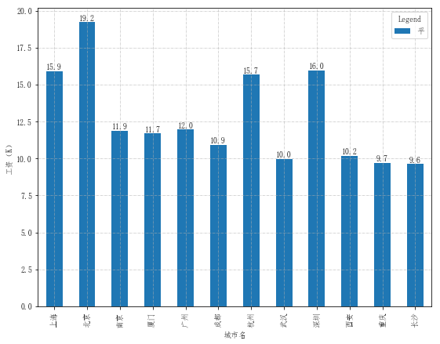


```python
# 使用 matplotlib 画图
x = np.arange(len(df_clean.groupby('job_place').mean()))
y = df_clean.groupby('job_place').mean()
rects = plt.bar(x,y['avgsalary'], tick_label=y.index,label=u'平均工资')

# 设置图标标签
plt.title(u'拉钩网招聘城市平均工资',fontdict=font)
# 设置坐标轴标签
plt.xlabel(u'城市名')
plt.ylabel(u'工资（K）')
# 可以自己调节图例的位置 loc=1 在右上角 =2左上角 =3 左下角 =4 右下角 一般使用 =‘best’ 自动调整
# 显示的长度存在问题，该怎么解决呢
# plt.legend(labels=u'Salary',loc='best',ncol=2,borderaxespad=0,title='Legend')
plt.legend(title='Legend')
# 显示网格
plt.grid(True,linestyle = '-.',linewidth = 0.5)

# 设置数据标签
for rect in rects:
    # print(rect)
    h = rect.get_height()
    plt.text(rect.get_x()+rect.get_width()/2,h,'%.1f' % float(h), ha='center', va='bottom')

    
type(rects)

```


    matplotlib.container.BarContainer


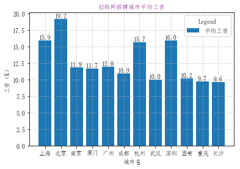


分析不同城市不同学历的平均工资


```python
ax = df_clean.groupby(['job_place','job_ed']).mean().unstack().plot.bar(figsize=(15,7))
# 显示网格
plt.grid(True,linestyle = '-.',linewidth = 0.5)
ax.set_title('不同城市与学历与平均工资图')

# 怎么获取柱状图的高度并显示出来,终于搞出来啦，哈哈哈
for rects in ax.containers:
    for rect in rects:
        h = rect.get_height()
        plt.text(rect.get_x()+rect.get_width()/2,h,'%.1f' % float(h), ha='center', va='bottom')
plt.savefig('test.png')
plt.show()

```


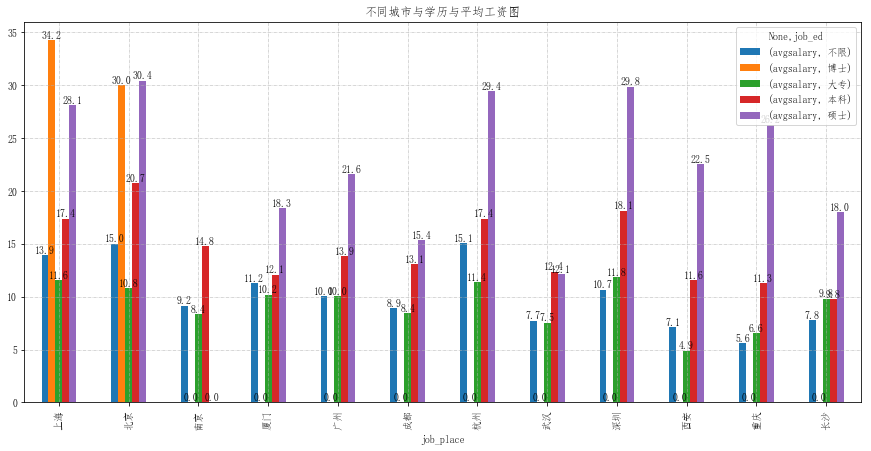


### 直方图
* 多个城市同时查看，设置不同的颜色和透明度


```python
# 上海北京平均工资分布图，用于比较上海和北京平均工资分布差异
# density 参数转化为密度
# alpha 参数设置透明度
plt.hist(x = df_clean[df_clean.job_place=='上海'].avgsalary,
        bins = 15,
        density = 1,
        facecolor = 'blue',
        alpha = 0.5)
plt.hist(x = df_clean[df_clean.job_place=='北京'].avgsalary,
        bins = 15,
        density = 1,
        facecolor = 'red',
        alpha = 0.5)

plt.grid(True,linestyle='-.',linewidth=0.5)

plt.show()
```


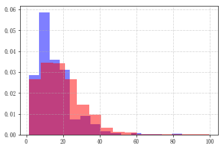


### 按薪酬级别进行分析


```python
# 使用 cut函数对数据进行分级切割
bins = [0,3,5,10,15,20,30,100]
level = ['0-3','3-5','5-10','10-15','15-20','20-30','30+']

df_clean['level'] = pd.cut(df_clean['avgsalary'],bins = bins,labels = level).copy()
```

    C:\Anaconda3\envs\env36\lib\site-packages\ipykernel\__main__.py:5: SettingWithCopyWarning: 
    A value is trying to be set on a copy of a slice from a DataFrame.
    Try using .loc[row_indexer,col_indexer] = value instead
    
    See the caveats in the documentation: http://pandas.pydata.org/pandas-docs/stable/indexing.html#indexing-view-versus-copy
    


```python
df_clean[['avgsalary','level']].head(5)
```


<div>
<style scoped>
    .dataframe tbody tr th:only-of-type {
        vertical-align: middle;
    }

    .dataframe tbody tr th {
        vertical-align: top;
    }

    .dataframe thead th {
        text-align: right;
    }
</style>
<table border="1" class="dataframe">
  <thead>
    <tr style="text-align: right;">
      <th></th>
      <th>avgsalary</th>
      <th>level</th>
    </tr>
  </thead>
  <tbody>
    <tr>
      <th>0</th>
      <td>15.0</td>
      <td>10-15</td>
    </tr>
    <tr>
      <th>1</th>
      <td>17.5</td>
      <td>15-20</td>
    </tr>
    <tr>
      <th>2</th>
      <td>11.5</td>
      <td>10-15</td>
    </tr>
    <tr>
      <th>3</th>
      <td>15.0</td>
      <td>10-15</td>
    </tr>
    <tr>
      <th>4</th>
      <td>12.0</td>
      <td>10-15</td>
    </tr>
  </tbody>
</table>
</div>


```python
# 分组统计并将结果进行转置
df_level = df_clean.groupby(['job_place','level']).avgsalary.count().unstack()

# 根据计数结果，计算出对应薪酬水平的比例
df_level_prop = df_level.apply(lambda x: x/x.sum(), axis=1)
# stacke=True 表示柱状图堆叠
ax = df_level_prop.plot.bar(stacked = True,figsize = (9,7))
# 设置图例
ax.legend(loc='best',bbox_to_anchor=(0.05,1),ncol=7,title='level')
```


    <matplotlib.legend.Legend at 0x2e42a4d47b8>


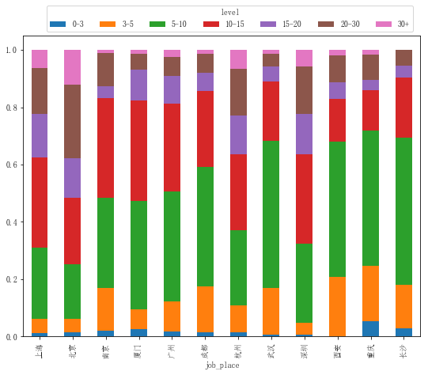


```python
ax = df_level_prop.plot.barh(stacked=True,figsize=(9,9))
ax.legend(loc='best',bbox_to_anchor=(0.01,1),ncol=7,title='level')
ax.set_xlabel(u'比例（%）')
ax.set_ylabel(u'城市名')
```


    Text(0,0.5,'城市名')


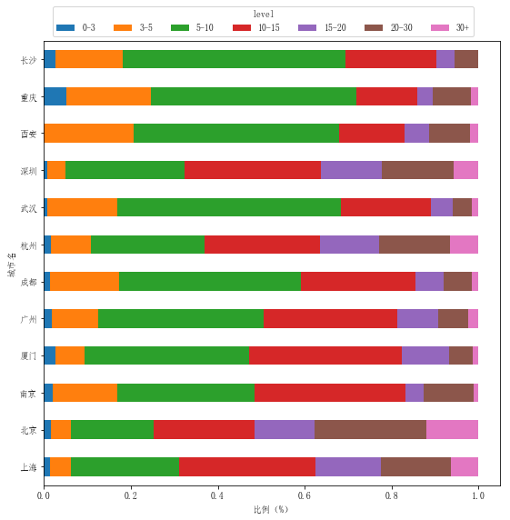


### 提取词云


```python
df_clean.head()
```


<div>
<style scoped>
    .dataframe tbody tr th:only-of-type {
        vertical-align: middle;
    }

    .dataframe tbody tr th {
        vertical-align: top;
    }

    .dataframe thead th {
        text-align: right;
    }
</style>
<table border="1" class="dataframe">
  <thead>
    <tr style="text-align: right;">
      <th></th>
      <th>menu_name</th>
      <th>job_place</th>
      <th>jobClass</th>
      <th>job_id</th>
      <th>jobName</th>
      <th>job_payment</th>
      <th>positionlabel</th>
      <th>job_experience</th>
      <th>job_ed</th>
      <th>compansnum</th>
      <th>jobCompany</th>
      <th>jobPlace</th>
      <th>avgsalary</th>
      <th>level</th>
    </tr>
  </thead>
  <tbody>
    <tr>
      <th>0</th>
      <td>技术</td>
      <td>上海</td>
      <td>白盒测试</td>
      <td>4514376</td>
      <td>软件测试工程师（白盒）</td>
      <td>10k-20k</td>
      <td>[初级, 白盒, Java, 测试]</td>
      <td>不限</td>
      <td>本科</td>
      <td>150-500人</td>
      <td>泰为</td>
      <td>上海-长宁区-娄山关路523号金虹桥国际中心</td>
      <td>15.0</td>
      <td>10-15</td>
    </tr>
    <tr>
      <th>1</th>
      <td>技术</td>
      <td>北京</td>
      <td>DB2</td>
      <td>4366784</td>
      <td>DB2工程师</td>
      <td>15k-20k</td>
      <td>[资深, 高级, 数据库, 运维, DBA, DB2]</td>
      <td>5-10年</td>
      <td>大专</td>
      <td>150-500人</td>
      <td>云和恩墨</td>
      <td>北京-朝阳区-光华路9号光华路soho二期b座10层</td>
      <td>17.5</td>
      <td>15-20</td>
    </tr>
    <tr>
      <th>2</th>
      <td>技术</td>
      <td>广州</td>
      <td>DB2</td>
      <td>3055927</td>
      <td>DB2/Informix高级DBA</td>
      <td>8k-15k</td>
      <td>[MySQL, 云计算, linux, DBA, DB2, Java]</td>
      <td>3-5年</td>
      <td>大专</td>
      <td>15-50人</td>
      <td>颉一软件</td>
      <td>广州-天河区-大观中路科汇园E栋406</td>
      <td>11.5</td>
      <td>10-15</td>
    </tr>
    <tr>
      <th>3</th>
      <td>技术</td>
      <td>杭州</td>
      <td>电商产品经理</td>
      <td>4644136</td>
      <td>电商产品经理</td>
      <td>10k-20k</td>
      <td>[客户端, 产品经理, 需求分析, 移动, 电商]</td>
      <td>1-3年</td>
      <td>本科</td>
      <td>50-150人</td>
      <td>青友汇</td>
      <td>杭州-江干区-钱江新城荣安大厦1401</td>
      <td>15.0</td>
      <td>10-15</td>
    </tr>
    <tr>
      <th>4</th>
      <td>技术</td>
      <td>北京</td>
      <td>游戏动作</td>
      <td>2075674</td>
      <td>游戏动作</td>
      <td>8k-16k</td>
      <td>[游戏, 动作]</td>
      <td>不限</td>
      <td>不限</td>
      <td>15-50人</td>
      <td>奥矩科技</td>
      <td>北京-朝阳区-大屯路东170号凯旋城E座605</td>
      <td>12.0</td>
      <td>10-15</td>
    </tr>
  </tbody>
</table>
</div>


```python
# 通过apply和value_counts函数统计标签数[统计所有标签在各个职位的出现次数]
df_word = df_clean.positionlabel.apply(pd.value_counts)
# dropna删除空值
# reset_index重置索引
df_word_counts = df_word.unstack().dropna().reset_index().groupby('level_0').count()

df_word_counts.head()
```


<div>
<style scoped>
    .dataframe tbody tr th:only-of-type {
        vertical-align: middle;
    }

    .dataframe tbody tr th {
        vertical-align: top;
    }

    .dataframe thead th {
        text-align: right;
    }
</style>
<table border="1" class="dataframe">
  <thead>
    <tr style="text-align: right;">
      <th></th>
      <th>level_1</th>
      <th>0</th>
    </tr>
    <tr>
      <th>level_0</th>
      <th></th>
      <th></th>
    </tr>
  </thead>
  <tbody>
    <tr>
      <th>.NET</th>
      <td>3</td>
      <td>3</td>
    </tr>
    <tr>
      <th>.net</th>
      <td>34</td>
      <td>34</td>
    </tr>
    <tr>
      <th>2D</th>
      <td>34</td>
      <td>34</td>
    </tr>
    <tr>
      <th>3D</th>
      <td>35</td>
      <td>35</td>
    </tr>
    <tr>
      <th>3DMax</th>
      <td>1</td>
      <td>1</td>
    </tr>
  </tbody>
</table>
</div>


```python
# 词云展示
from wordcloud import WordCloud


# 数据整理
# 通过apply和value_counts函数统计标签数[统计所有标签在各个职位的出现次数]
df_word = df_clean.positionlabel.apply(pd.value_counts)
# dropna删除空值
# reset_index重置索引
df_word_counts = df_word.unstack().dropna().reset_index().groupby('level_0').count()


# wordcloud 支持 ttf
wordcloud = WordCloud(font_path='C:\Windows\Fonts\YaHei.TTf',
    width=900, height=400,
    background_color = 'white')

# 不指定字体是，需要修改脚本28行，修改默认字体，避免中文显示乱码
#wordcloud = WordCloud(
#    width=900, height=400,
#    background_color = 'white')


f, axs = plt.subplots(figsize=(15,15))
wordcloud.fit_words(df_word_counts.level_1)
axs = plt.imshow(wordcloud)
plt.axis('off')
plt.show()

```


```python
# 使用遮罩图片
import matplotlib.pyplot as plt
from wordcloud import WordCloud,ImageColorGenerator
import numpy as np 
import PIL.Image as Image


# 数据整理
# 通过apply和value_counts函数统计标签数[统计所有标签在各个职位的出现次数]
df_word = df_clean.positionlabel.apply(pd.value_counts)
# dropna删除空值
# reset_index重置索引
df_word_counts = df_word.unstack().dropna().reset_index().groupby('level_0').count()


# 打开图片
coloring = np.array(Image.open("xiaohuanren.png"))
# WordCloud 参数调解
wordcloud = WordCloud(background_color = 'white',#背景色 black
                     max_words=2000,#
                     mask = coloring,#遮罩图，字的大小布局和颜色都会依据遮罩图生成
                     max_font_size=60,#最大字号
                     random_state = 42,
                     scale = 8,#加大该值会比使用更大的图更快，但值越高也会越慢（计算更复杂）。默认值是1
                     font_path = 'C:\Windows\Fonts\YaHei.TTf')

# 绘制词云
f, axs = plt.subplots(figsize=(15,15))
wordcloud.fit_words(df_word_counts.level_1)
axs = plt.imshow(wordcloud)
plt.axis('off')
plt.savefig('wordren.png')
plt.show()

```


```python

# 数据整理
# 通过apply和value_counts函数统计标签数[统计所有标签在各个职位的出现次数]
word_scr =  data.job_scr.apply(pd.value_counts)
# dropna删除空值
# reset_index重置索引
word_scr_counts = word_scr.unstack().dropna().reset_index().groupby('level_0').count()

word_scr_counts = word_scr_counts.drop(['A','B','D','E','F','O','G','T','K','J','H'])
# 排序
word_scr_counts.sort_values(by='level_1',ascending=False)
wordcloud = WordCloud(background_color = 'white',#背景色 black
                     max_font_size=60,#最大字号
                     random_state = 42,
                     width=900, height=400,
                     scale = 8,#加大该值会比使用更大的图更快，但值越高也会越慢（计算更复杂）。默认值是1
                     font_path = 'C:\Windows\Fonts\YaHei.TTf')

# 绘制词云
f, axs = plt.subplots(figsize=(15,15))
wordcloud.fit_words(word_scr_counts.level_1)
axs = plt.imshow(wordcloud)
plt.axis('off')
plt.savefig('wordrenscr.png')
plt.show()


```


```python
type(word_scr)
```


    pandas.core.frame.DataFrame


```python
# 获取前二十个类技能计数最多的技能
word_scr_counts.sort_values(by='level_1',ascending=False).head(20)
```


<div>
<style scoped>
    .dataframe tbody tr th:only-of-type {
        vertical-align: middle;
    }

    .dataframe tbody tr th {
        vertical-align: top;
    }

    .dataframe thead th {
        text-align: right;
    }
</style>
<table border="1" class="dataframe">
  <thead>
    <tr style="text-align: right;">
      <th></th>
      <th>level_1</th>
      <th>0</th>
    </tr>
    <tr>
      <th>level_0</th>
      <th></th>
      <th></th>
    </tr>
  </thead>
  <tbody>
    <tr>
      <th>C</th>
      <td>724</td>
      <td>724</td>
    </tr>
    <tr>
      <th>LINUX</th>
      <td>622</td>
      <td>622</td>
    </tr>
    <tr>
      <th>PYTHON</th>
      <td>616</td>
      <td>616</td>
    </tr>
    <tr>
      <th>JAVA</th>
      <td>566</td>
      <td>566</td>
    </tr>
    <tr>
      <th>MYSQL</th>
      <td>422</td>
      <td>422</td>
    </tr>
    <tr>
      <th>APP</th>
      <td>416</td>
      <td>416</td>
    </tr>
    <tr>
      <th>SQL</th>
      <td>396</td>
      <td>396</td>
    </tr>
    <tr>
      <th>WEB</th>
      <td>356</td>
      <td>356</td>
    </tr>
    <tr>
      <th>EXCEL</th>
      <td>298</td>
      <td>298</td>
    </tr>
    <tr>
      <th>SHELL</th>
      <td>273</td>
      <td>273</td>
    </tr>
    <tr>
      <th>HTML</th>
      <td>229</td>
      <td>229</td>
    </tr>
    <tr>
      <th>OFFICE</th>
      <td>225</td>
      <td>225</td>
    </tr>
    <tr>
      <th>ORACLE</th>
      <td>221</td>
      <td>221</td>
    </tr>
    <tr>
      <th>UI</th>
      <td>213</td>
      <td>213</td>
    </tr>
    <tr>
      <th>JAVASCRIPT</th>
      <td>211</td>
      <td>211</td>
    </tr>
    <tr>
      <th>REDIS</th>
      <td>201</td>
      <td>201</td>
    </tr>
    <tr>
      <th>HTTP</th>
      <td>196</td>
      <td>196</td>
    </tr>
    <tr>
      <th>PPT</th>
      <td>196</td>
      <td>196</td>
    </tr>
    <tr>
      <th>ANDROID</th>
      <td>195</td>
      <td>195</td>
    </tr>
    <tr>
      <th>HADOOP</th>
      <td>191</td>
      <td>191</td>
    </tr>
  </tbody>
</table>
</div>


